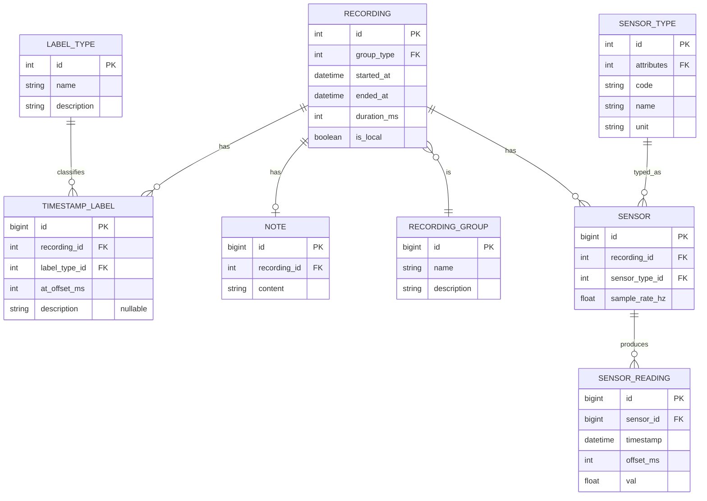

# TupTrack database schema 

## Notes
- In this schema, only one group can be assigned to a recording.
- Only one note can be assigned to a recording.
- It will be possible to add a description to an event.
- Wi-Fi, Bluetooth, and other named sensors will be stored as attributes in `SensorType`.
  - TODO: add these attributes.
- The sampling rate may change while the application is running, for example when it is moved to the background, so the rate is stored in the `Sensor` table rather than in `SensorType`.
- There are two possible ways to handle sensors that output data in more than one dimension:
  1. represent each dimension as a separate sensor type,
  2. store multiple values in `SensorReading`, for example using nullable fields such as `y`, `z`, `v4`, `v5`, and `v6`.
- It is possible that some additional fields related to the upload state of a recording will be required.
- It is not yet clear what is better in `SensorReading`: storing an offset or a datetime value. It is also possible that this will not be enough to sort readings in the correct order, so there may need to be an additional field indicating the reading number.
