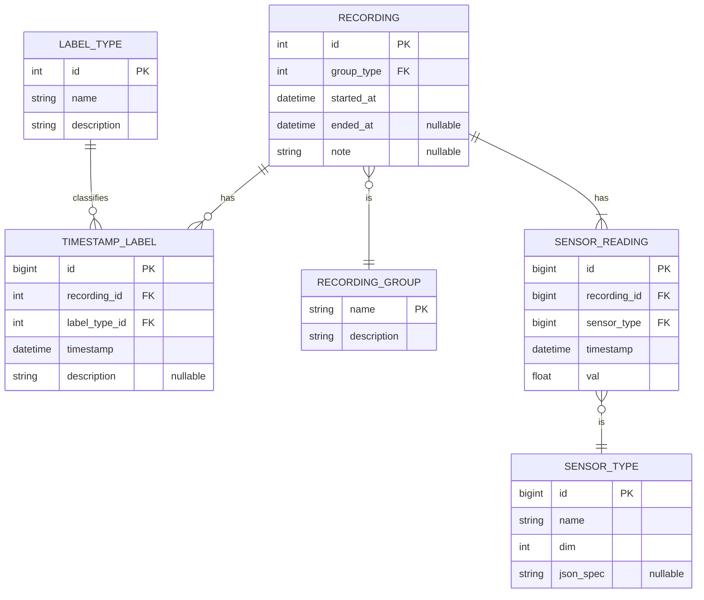

# TupTrack database schema 

## Notes
- Wi-Fi, Bluetooth, and other named sensors will be stored as attributes in `SensorType`.
  - TODO: add these attributes.
- If there will be decision to virtuali synchornise additional fields will be needed

